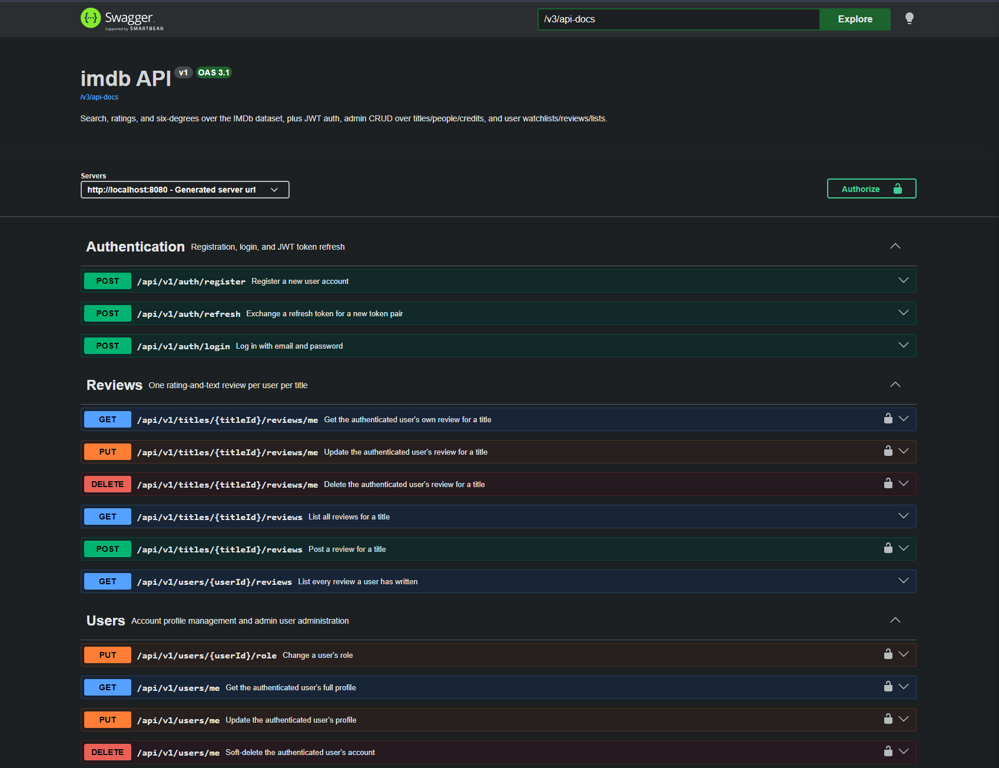
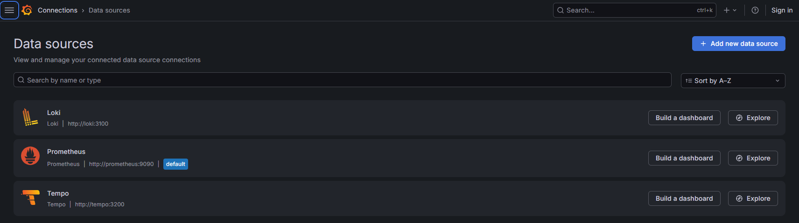
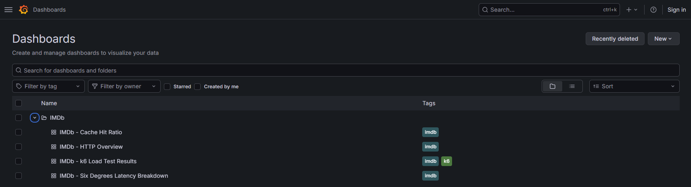
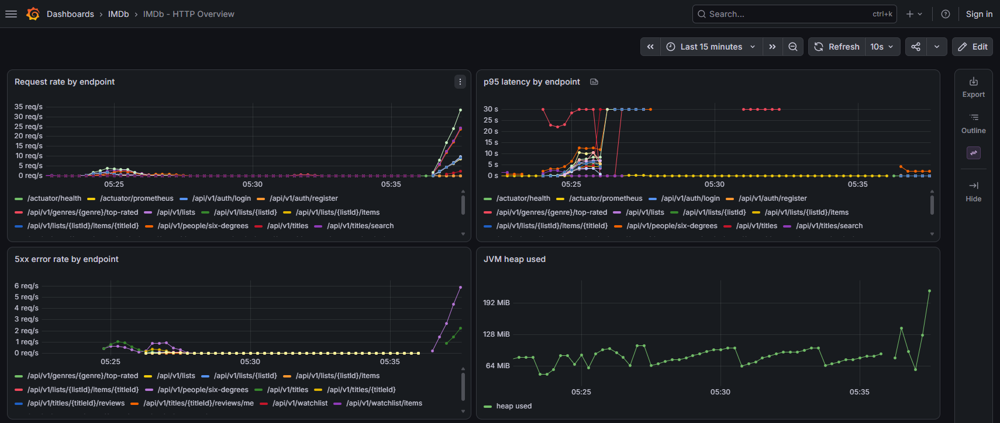
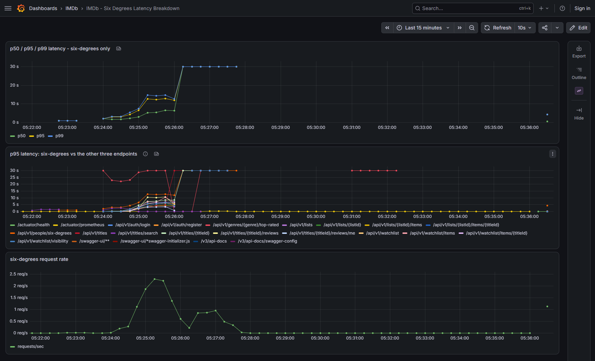
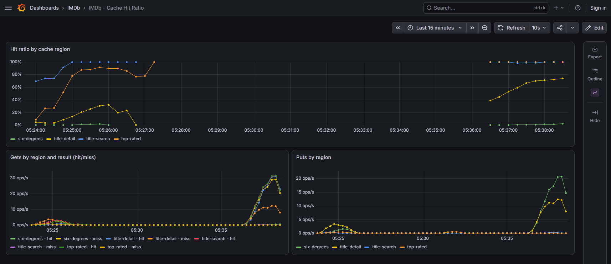
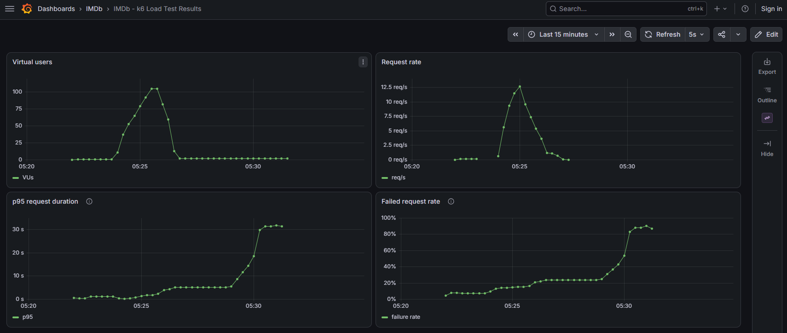
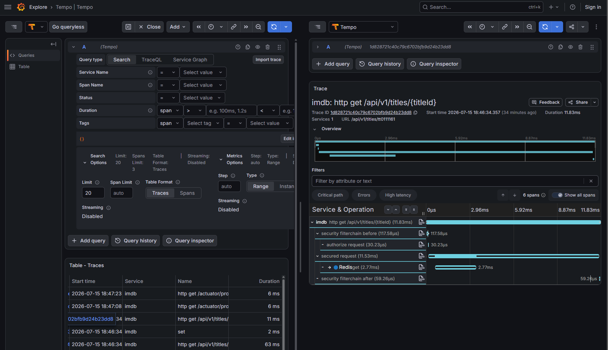
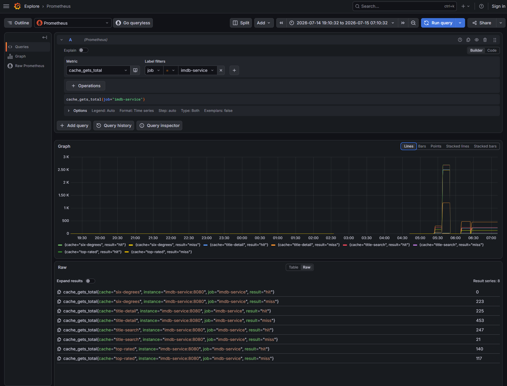
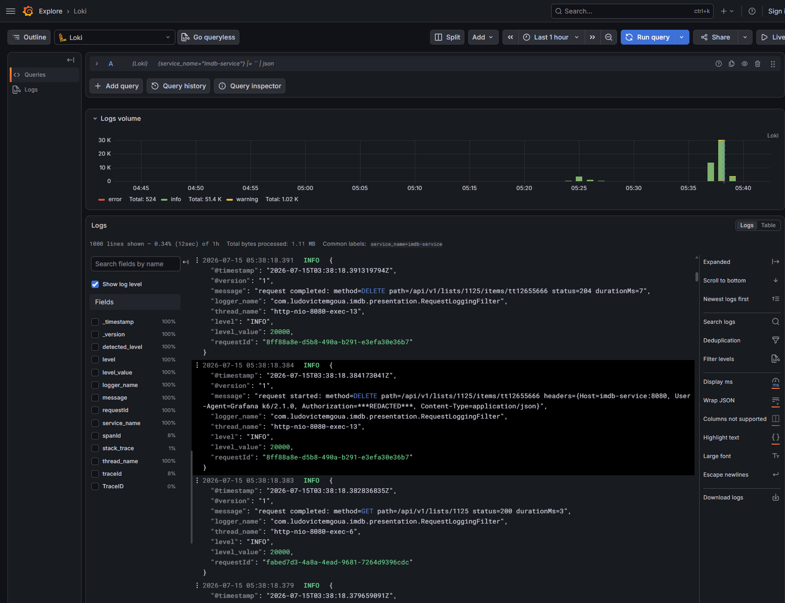

# imdb

A production-shaped Spring Boot REST API over the full [IMDb Non-Commercial Dataset](https://www.imdb.com/interfaces/): title search with cast/crew, top-rated movies by genre, and a generalized "Six Degrees of Kevin Bacon" graph query. Part of a deliberate, professional-grade return to the Java ecosystem (see the [root README](../README.md)): real indexing decisions, a literature-grounded algorithm choice for the graph problem, full observability, and a three-tier test pipeline, not a toy CRUD example.

[](https://github.com/icemc/java-backend-playground/actions/workflows/imdb-ci.yml)


## Table of contents

- [What this is](#what-this-is)
- [Functional requirements](#functional-requirements)
- [Architecture](#architecture)
  - [Onion layering](#onion-layering)
  - [Package layout](#package-layout)
  - [Key design decisions](#key-design-decisions)
  - [Six Degrees of Kevin Bacon](#six-degrees-of-kevin-bacon)
  - [Caching strategy](#caching-strategy)
- [API](#api)
- [Authentication](#authentication)
- [Observability](#observability)
  - [Correlation in practice](#correlation-in-practice)
- [External services](#external-services)
- [Testing strategy](#testing-strategy)
- [DevOps](#devops)
- [Load testing](#load-testing)
- [Running it locally](#running-it-locally)
- [Project layout](#project-layout)
- [Design documents](#design-documents)
- [Known limitations](#known-limitations)
- [License](#license)

## What this is

Given the real, untruncated IMDb dataset (millions of titles and people, tens of millions of cast/crew credits), `imdb` exposes four read-only REST endpoints, backed by:

- Hand-tuned native SQL (trigram fuzzy search, GIN array containment, a Bayesian weighted rating, a custom bidirectional-BFS PL/pgSQL function) instead of an ORM (see [Why plain JDBC](#key-design-decisions)).
- Redis cache-aside in front of every endpoint, since the dataset only changes on a one-time image reload.
- Full observability: structured JSON logs, Prometheus metrics, and OpenTelemetry traces, correlated in one Grafana instance.
- A three-tier test pipeline (unit → Testcontainers integration → Postman/Newman e2e) wired into CI.
- k6 load testing, both per-endpoint and all-endpoints-at-once, with results pushed into the same observability stack.

## Functional requirements

| # | Requirement | Endpoint |
|---|---|---|
| 1 | Search a movie by title; show related cast/crew | `GET /api/v1/titles/search`, `GET /api/v1/titles/{titleId}` |
| 2 | Top-rated movies in a given genre | `GET /api/v1/genres/{genre}/top-rated` |
| 3 | Degree of separation between any two people ("Six Degrees", generalized beyond a fixed Kevin Bacon root) | `GET /api/v1/people/six-degrees` |

Full requirements and guidelines: [`docs/REQUIREMENTS.md`](docs/REQUIREMENTS.md).

## Architecture

### Onion layering

`presentation → infrastructure → application → domain`, plus a dependency-free `utils` layer. Import direction alone enforces the dependency rule: `application` never imports `infrastructure`, and `domain` imports nothing.

| Layer | Contains |
|---|---|
| `presentation` | Controllers, `ApiExceptionHandler`, `RequestLoggingFilter` |
| `infrastructure` | JDBC repository implementations, Redis caching decorators, `@Configuration` |
| `application` | Use-case interfaces + implementations |
| `domain` | Entities/value objects, repository **interfaces**, domain exceptions |
| `utils` | `ImdbIds`, `HeaderSanitizer`: pure, framework-free helpers |

Every top-level use case a controller depends on is an interface (`TitleSearchUseCase`, `TitleDetailUseCase`, `TopRatedUseCase`, `SixDegreesUseCase`), with a plain `*Impl` and, where caching applies, an `infrastructure.cache` decorator marked `@Primary`:

```
application.contracts.TitleSearchUseCase (interface)
  ├─ application.TitleSearchUseCaseImpl               - plain orchestration, no caching
  └─ infrastructure.cache.CachingTitleSearchUseCase    - @Primary, @Cacheable, delegates to the Impl above
```

A controller depends on the interface and never learns which implementation it got. Swapping cache technology, or Postgres for another store, touches exactly one layer.

### Package layout

```
imdb/
  src/main/java/com/ludovictemgoua/imdb/
    domain/            entities, repository interfaces, domain exceptions
    application/       use-case interfaces (contracts/) + plain implementations
    infrastructure/
      persistence/      JDBC repository implementations
      cache/            Redis caching decorators, CacheConfig
    presentation/       controllers, ApiExceptionHandler, RequestLoggingFilter
    utils/              ImdbIds, HeaderSanitizer - dependency-free
  src/main/resources/
    application.yaml
    db/migration/       Flyway V0-V4 (base schema, indexes, materialized view, BFS function)
  src/test/             unit + Testcontainers integration tests, shared fixtures
  k6/                   one load-test script per endpoint
  postman/              e2e contract test collection
  observability/        Prometheus/Loki/Tempo/Alloy/Grafana provisioning
  docs/                 REQUIREMENTS.md, product-design.md, low-level-design.md
```

### Key design decisions

| Decision | Chosen approach | Why |
|---|---|---|
| Data access | Plain `NamedParameterJdbcTemplate`, no JPA/Hibernate | Every query is a hand-tuned native query (trigram search, array containment, a graph BFS function); no object graph is being mutated, only read projections. |
| Six Degrees algorithm | Bidirectional BFS as a PL/pgSQL function, meeting in the middle | A one-sided walk pays the graph's full branching factor per hop against hub actors with thousands of co-stars; meeting in the middle roughly squares down the search space, and the 7-degree cap means each side only expands ~4 hops. See [below](#six-degrees-of-kevin-bacon). |
| Result caching | Redis cache-aside, keyed by the **unordered** person pair, storing the true shortest distance up to the absolute 7-degree cap | A distance is a fact independent of the caller's requested `maxDegree`: one cache entry serves every request for that pair regardless of their bound. |
| Top-rated ranking | IMDb-style weighted (Bayesian) rating, not raw average | A raw average lets a movie with 3 votes at 10/10 outrank one with 500,000 votes at 8.9. |
| Title search | PostgreSQL `pg_trgm` similarity search, GIN-indexed | Tolerates typos/partial matches while staying index-backed against a multi-million-row table. |
| API ID format | Public API uses IMDb-style `tt`/`nm` string IDs, translated at the repository boundary (`utils.ImdbIds`) | The internal integer PK is an artifact of the seed image's import script, not a stable public contract. |
| Build tool | Maven | Consistent with [`votee`](../votee) elsewhere in this monorepo. |

Full rationale, including alternatives considered (precomputed BFS, Pruned Landmark Labeling, Neo4j) and why they were rejected: [`docs/product-design.md`](docs/product-design.md) §9.

### Six Degrees of Kevin Bacon

The first working version was a single bidirectional recursive CTE. It passed review and its own tests, then failed under real data two distinct ways: a fixed fan-out cap could silently drop the true connecting co-star (a *wrong-answer* bug, not just slow), and cycle prevention only checked a single path's own history, so the same hub node got independently re-expanded by every path that reached it (a real hub-to-hub query took 3+ minutes and spilled to disk).

The fix moved the traversal into a PL/pgSQL function (`find_shortest_co_star_path`, `V3__shortest_co_star_path_function.sql`) with genuine iterative state: two `TEMP TABLE`s hold a real, de-duplicated visited set and parent pointer per side, expanding whichever frontier is currently smaller, with no arbitrary neighbor cap. Verified against the exact pathological pair that broke the old query (two ~8,000-co-star hub nodes, no direct edge): **29-44ms and a correct degree-2 result, versus 3+ minutes and a disk spill before.**

Full derivation, including the two specific bugs found and fixed: [`docs/low-level-design.md`](docs/low-level-design.md) §5.

### Caching strategy

| Cache region | Key | TTL | Cached at |
|---|---|---|---|
| `title-search` | `query, page, size` | 24h | Use-case decorator |
| `title-detail` | `titleId` | 24h | Use-case decorator (one entry for the fully-assembled detail, even though it fans out to five repository calls) |
| `top-rated` | `genre, limit, minVotes` | 24h | Use-case decorator |
| `six-degrees` | `min(personA,personB)-max(personA,personB)` | 24h | Repository decorator, cached one layer deeper than the other three, since the use case's raw inputs (names needing disambiguation, a variable `maxDegree`) make a poor cache key, while the repository's `findShortestPath(int, int)` doesn't |

All TTLs are long because the dataset only changes on image reload; there is no write path invalidating entries mid-flight.

## API

| Method | Path | Description |
|---|---|---|
| GET | `/api/v1/titles/search?title=&page=&size=` | Fuzzy trigram search, paginated |
| GET | `/api/v1/titles/{titleId}` | Full detail: metadata, rating, directors/writers, top-billed cast |
| GET | `/api/v1/genres/{genre}/top-rated?limit=&minVotes=` | Top-rated movies by weighted rating |
| GET | `/api/v1/people/six-degrees?personA=&personB=&maxDegree=` | Degree of separation; returns a disambiguation payload (HTTP 200) instead of an error when a `name` matches more than one person |

All errors are RFC 7807 `ProblemDetail` (404 for unknown IDs, 400 for malformed IDs/out-of-range `maxDegree`/missing params, 405 for the wrong HTTP method). Full contracts, request/response shapes, and error handling: [`docs/low-level-design.md`](docs/low-level-design.md) §4/§9.

Interactive API docs, generated from the live controllers: [`/swagger-ui/index.html`](http://localhost:8080/swagger-ui/index.html) (Swagger UI) or [`/redoc.html`](http://localhost:8080/redoc.html) (Redoc), both reading the same generated document at `/v3/api-docs`.



*Every one of the 48 endpoints carries a real summary, description, and per-status-code response doc via `@Operation`/`@ApiResponses` - not the auto-generated `delete_3`/`create_1` operationIds a default springdoc setup produces. Bearer-auth is wired into the "Authorize" button, so every "try it out" call on a protected endpoint just works.*

Beyond the original read-only endpoints above, a later CRUD expansion (`docs/crud-expansion-design.md`) added admin write access over the core entities and a user-generated-content layer, all under JWT auth ([Authentication](#authentication)):

| Group | Endpoints | Notes |
|---|---|---|
| Admin: titles | `POST/PUT/PATCH/DELETE /api/v1/titles`, `PUT /api/v1/titles/{titleId}/crew`, `PUT/DELETE /api/v1/titles/{titleId}/rating`, full CRUD on `/api/v1/titles/{titleId}/principals` | `hasRole('ADMIN')`; optimistic locking via a `version` field, `409` on conflict |
| Admin: people | `POST/PUT/PATCH/DELETE /api/v1/people` | `hasRole('ADMIN')`, same versioning convention |
| Watchlist | `GET/PUT /api/v1/watchlist`, `POST/DELETE /api/v1/watchlist/items{,/{titleId}}`, `GET /api/v1/users/{userId}/watchlist` | One per user; `PRIVATE` by default |
| Reviews | Full CRUD under `/api/v1/titles/{titleId}/reviews`, plus `GET /api/v1/users/{userId}/reviews` | One review per `(user, title)`; feeds `userRatingAverage`/`userRatingCount` on title detail |
| Custom lists | Full CRUD under `/api/v1/lists`, plus `GET /api/v1/lists/public` | `PUBLIC`/`PRIVATE` visibility; viewing someone else's `PRIVATE` resource is `404`, writing to their `PUBLIC` one is `403` |

Full endpoint tables and the exact negative-case contract (403 vs. 404 vs. 409) per resource: [`docs/crud-expansion-design.md`](docs/crud-expansion-design.md) §4/§5.

## Authentication

Stateless JWT, issued and verified by `infrastructure.security` (`JwtService`, `JwtAuthenticationFilter`, `SecurityConfig`):

- `POST /api/v1/auth/register` / `POST /api/v1/auth/login` return an access token and a refresh token; `POST /api/v1/auth/refresh` exchanges a valid refresh token for a new pair.
- Every admin-write endpoint is gated `@PreAuthorize("hasRole('ADMIN')")`; every user-content write endpoint requires an authenticated user, resolved from the JWT's subject claim (`infrastructure.security.CurrentUser`).
- A fresh environment has no admin account by default. Setting `IMDB_BOOTSTRAP_ADMIN_EMAIL`/`IMDB_BOOTSTRAP_ADMIN_PASSWORD` (both `docker-compose.yaml` and `docker-compose.e2e.yaml`) makes `BootstrapAdminRunner` create exactly one `ADMIN` account on startup, if one doesn't already exist - the only way to get a first admin without direct database access.
- `JWT_SECRET` must be set (no default) for the application to start; test/e2e environments use a fixed, clearly-non-production value (Maven Surefire/Failsafe `environmentVariables`, `docker-compose.e2e.yaml`).

## Observability

- **Metrics**: `micrometer-registry-prometheus`. Default HTTP (`http.server.requests`, with percentile-histogram buckets enabled) and JVM/process metrics via Boot's auto-configuration. Cache hit/miss/put counters per region are **manually** bound (`infrastructure.cache.CacheConfig`) via Spring Data Redis's own `RedisCacheWriter` statistics. Spring Boot 4.1 dropped its Boot-2/3-era automatic cache-metrics binding entirely (confirmed by decompiling the actual jar), so this design replicates it rather than relying on a feature that no longer exists.
- **Logging**: structured JSON via Spring Boot 4.1's native structured logging (`logging.structured.format.console: logstash`, no extra dependency). A `RequestLoggingFilter` assigns/honors a per-request `X-Request-Id`, independent of trace sampling, alongside Micrometer's `traceId`/`spanId`; both land in every log line's MDC, including the filter's own request-start/request-completed lines (needed a filter-order fix past Spring's own tracing filter to actually cover those two - [`docs/low-level-design.md`](docs/low-level-design.md) §7.2). `utils.HeaderSanitizer` redacts sensitive headers (`Authorization`, `Cookie`, `Set-Cookie`, `X-Api-Key`) before anything is logged. Shipped to Loki via Grafana Alloy.
- **Tracing**: `spring-boot-starter-opentelemetry` (Boot 4.1's unified tracing starter) exports to Tempo via OTLP, 100% sampled for this exercise. A trace covers the full request lifecycle, not just HTTP/Security: `datasource-micrometer` gives every DB connection-acquire and SQL statement its own span (real HikariCP pool name, real query text), Boot's own Lettuce integration gives every Redis command its own span, and a `HandlerInterceptor` gives each controller method its own span tagged with the cache hit/miss outcome. Details and a real trace shape: §7.2.
- **Correlation**: Grafana's datasources are provisioned with Loki ⇄ Tempo ⇄ Prometheus derived-field wiring, so a trace opened in Grafana click-throughs to its log lines and vice versa.



*All three signal types wired up as code (`observability/grafana/provisioning/datasources/`), not clicked together by hand in the UI - a fresh `docker-compose up` reproduces this exactly.*

- **Dashboards**: four Grafana dashboards, provisioned from `observability/grafana/provisioning/dashboards/json/`, verified against live traffic (every panel's PromQL checked against a real scrape, not just schema-checked):

  | Dashboard | Covers |
  |---|---|
  | HTTP Overview | Request rate by endpoint, p95 latency by endpoint, 5xx error rate, JVM heap used |
  | Six Degrees Latency Breakdown | p50/p95/p99 latency for the six-degrees endpoint specifically, versus the other three endpoints, and its request rate; this is the one endpoint whose cost depends on graph shape, not a bounded index lookup |
  | Cache Hit Ratio | Hit ratio by region, gets by region/result, puts by region |
  | k6 Load Test Results | Virtual users, request rate, p95 request duration, failed request rate, fed by a k6 run's own Prometheus remote-write output |





*Mid-load-test, not a static demo: request rate and p95 latency climbing together across every endpoint, JVM heap tracking along with it.*



*The one endpoint that isn't a bounded index lookup gets its own dedicated latency breakdown - p99 pinned at the graph query's timeout ceiling, visibly separated from the other three endpoints on the same axes. This is what makes the accepted ~25-30% hard-pair failure rate ([Known limitations](#known-limitations)) a measured, monitored trade-off instead of an invisible one.*



*Cache warming visible in real time - hit ratio climbing from 0% (cold) to 80-100% per region as repeat traffic lands, backed by the manually-rebuilt `cache.gets`/`cache.puts` counters (Boot 4.1 dropped the auto-binding this depended on - §7.1).*



*Left as originally captured, failure spike included on purpose: this dashboard's job is to catch regressions, and it did - this exact run is what first surfaced the connection-pool exhaustion and schema-drift bugs fixed and documented in [Load testing](#load-testing). A clean screenshot would prove less than this one does.*

### Correlation in practice

The payoff of wiring all three signals together: open a trace in Tempo and see the actual request broken into spans, not just "this endpoint took 220ms."



*One real trace (`GET /api/v1/titles/{titleId}`), opened directly in Grafana's Tempo explorer: Spring Security's filter-chain overhead broken out from the actual data fetch, each span independently timed, all under one trace ID. A different request (a cache miss) additionally shows a `TitleController#get` span tagged `cache.result=miss`, HikariCP connection-acquire, the real SQL text, and row count as separate spans underneath it - full shape documented in [`docs/low-level-design.md`](docs/low-level-design.md) §7.2.*



*The metric backing the Cache Hit Ratio dashboard above, queried directly - a hand-rolled `FunctionCounter` (`CacheConfig.cacheStatisticsMeterBinder`), not a framework default.*



*Structured JSON logs in Loki, one `RequestLoggingFilter` line per request lifecycle event - `requestId`, `traceId`, and `spanId` all queryable as first-class fields, not buried in an unstructured message string.*

Full wiring details, including four real bugs found and fixed while verifying the dashboards against live data (missing percentile-histogram config, Boot 4.1's removed cache-metrics auto-binding, an invalid Prometheus flag, and wrong assumptions about k6's remote-write metric shapes): [`docs/low-level-design.md`](docs/low-level-design.md) §7/§7.1.

## External services

Brought up by `docker-compose.yaml` alongside the application itself:

| Service | Image | Port(s) | Role |
|---|---|---|---|
| PostgreSQL | [`abanda/imdb-postgresql`](https://github.com/icemc/imdb-postgresql) | 5432 | The seeded IMDb dataset (full, untruncated) |
| Redis | `redis:7-alpine` | 6379 | Cache-aside store for all four endpoints |
| Prometheus | `prom/prometheus` | 9090 | Metrics scrape + k6 remote-write receiver |
| Grafana | `grafana/grafana` | 3001 (host) → 3000 | Dashboards, correlated logs/metrics/traces (anonymous admin access, local-only) |
| Loki | `grafana/loki` | 3100 | Log aggregation |
| Grafana Alloy | `grafana/alloy` | 12345 | Ships container logs to Loki |
| Tempo | `grafana/tempo` | 3200, 4317, 4318 | Distributed trace storage/query, OTLP receiver |
| postgres-exporter | `quay.io/prometheuscommunity/postgres-exporter` | 9187 | Postgres metrics for Prometheus |
| redis-exporter | `oliver006/redis_exporter` | 9121 | Redis metrics for Prometheus |
| k6 | `grafana/k6` | N/A | Load testing, opt-in via the `load-test` compose profile |

## Testing strategy

Three tiers, matching three sequential CI jobs (`unit` → `integration` → `e2e`); see [DevOps](#devops):

| Tier | Tooling | Scope |
|---|---|---|
| **Unit** (`mvn test`, Surefire) | JUnit 5 + Mockito + AssertJ | `application`-layer use cases against mocked `domain.repository` interfaces (no Spring, no Docker); `infrastructure.cache` decorators against a mocked delegate; this verifies delegation behavior but **cannot** catch real (de)serialization bugs, since nothing is actually serialized. |
| **Integration** (`mvn failsafe:integration-test failsafe:verify`, Failsafe) | Testcontainers (Postgres + Redis) | `infrastructure.persistence` against real Postgres (Flyway-migrated, shared fixture data). Four cache integration tests wired against a **real Redis**; this tier exists specifically because a real Redis is the only place a serialization bug (like an earlier `GenericJacksonJsonRedisSerializer` type-metadata bug this project hit) actually surfaces. |
| **E2E / contract** (Postman + Newman) | `docker-compose.e2e.yaml`, a fully-built app image against plain `postgres:17` + Redis | The only tier exercising the real `Dockerfile` image end-to-end, including the logging filter and exception handler wiring. Seeded with the *same* fixture dataset the integration tests use, one source of truth, not two to keep in sync. 19 requests, 32 assertions, covering every endpoint (including the CRUD-expansion auth/admin-write/user-content flows) and its documented edge cases. |

Current counts: 90 unit tests, 69 integration tests, all passing; e2e collection verified 32/32 assertions against a live stack.

Full test plan, including exactly why each tier exists and what it catches that the others can't: [`docs/low-level-design.md`](docs/low-level-design.md) §10.

## DevOps

- **Containerization**: multi-stage `Dockerfile` (`eclipse-temurin:21-jdk` build stage → `eclipse-temurin:21-jre` runtime stage), keeping the shipped image free of build tooling.
- **Local orchestration**: `docker-compose.yaml` brings up the full stack (database, cache, application, entire observability stack) with one command; a separate `docker-compose.e2e.yaml` (its own `name: imdb-e2e` and network) drives the CI e2e stage against a lightweight, fast-seeding Postgres instead of the ~20-30-minute full dataset import. Keeping the project name explicit here isn't cosmetic: two compose files in the same directory with matching service names and no distinct project name will make Compose *replace* one stack's containers with the other's, a real near-miss this project hit and fixed once and for all (see the compose file's own header comment).
- **CI**: [`imdb-ci.yml`](../.github/workflows/imdb-ci.yml), three sequential GitHub Actions jobs, each gated on the previous:
  1. `unit`: `mvn -B test`
  2. `integration`: `mvn -B failsafe:integration-test failsafe:verify` (Testcontainers)
  3. `e2e`: brings up `docker-compose.e2e.yaml`, polls for app health and seed completion, runs the Postman/Newman collection, dumps logs on failure, always tears down

## Load testing

One [k6](https://k6.io/) script per endpoint under `k6/`, run one at a time so results are attributable to a single endpoint, results pushed to Prometheus via `--out experimental-prometheus-rw` (visible in the k6 Load Test Results dashboard, [Observability](#observability)):

| Script | Pattern |
|---|---|
| `search.js` | Ramping VUs (0 → 50 → 100 → 0), random query terms |
| `title-detail.js` | Ramping VUs, random `tconst` from a pre-fetched pool |
| `top-rated.js` | Ramping VUs, cycles through all genres |
| `six-degrees.js` | Ramping VUs, **a distinct person pair per iteration**, deliberately defeating the Redis cache so the bidirectional BFS's real behavior under load is what gets measured |

```
docker compose --profile load-test run k6 run /scripts/six-degrees.js
```

`all-endpoints.js` takes the opposite approach on purpose: three scenarios (`browsing`, `userJourney`,
`adminWrites`) covering all 48 endpoints run *simultaneously*, to see how the system behaves when
everything is loaded at once rather than one endpoint in isolation. Running it for the first time found
five real bugs (Hikari pool sizing, three enum/schema drifts between this project's own Testcontainers
schema and the real imported database, and an admin id sequence colliding with orphaned imported rows) -
details in [`docs/low-level-design.md`](docs/low-level-design.md) §8.

```
docker compose --profile load-test run k6 run /scripts/all-endpoints.js
```

Full plan and per-endpoint thresholds: [`docs/low-level-design.md`](docs/low-level-design.md) §8.

## Running it locally

```
docker-compose up
```

Brings up Postgres (seeded via `abanda/imdb-postgresql`), Redis, the application, and the full observability stack. The **first run takes 20-30 minutes** while Postgres imports the full dataset; `docker-compose logs -f postgres` shows progress. Once healthy:

- API: `http://localhost:8080` (e.g. `curl http://localhost:8080/actuator/health`)
- Grafana: `http://localhost:3001` (anonymous admin access)
- Prometheus: `http://localhost:9090`

For contributing/building from source:

```
mvn test                                            # unit tests only, no Docker
mvn failsafe:integration-test failsafe:verify        # + Testcontainers integration tests
mvn package                                          # build the jar
```

## Project layout

See [Package layout](#package-layout) above for the Java source tree; the repository root also has:

```
imdb/
  pom.xml, Dockerfile, docker-compose.yaml, docker-compose.e2e.yaml
  k6/                 load-test scripts + sampled person-pair data
  postman/            e2e contract test collection
  observability/      Prometheus/Loki/Tempo/Alloy/Grafana provisioning
  docs/               REQUIREMENTS.md, product-design.md, low-level-design.md
```

## Design documents

- [`docs/REQUIREMENTS.md`](docs/REQUIREMENTS.md): the original brief and guidelines
- [`docs/product-design.md`](docs/product-design.md): what is being built and why, including algorithm alternatives considered
- [`docs/low-level-design.md`](docs/low-level-design.md): schema, endpoint contracts, the bidirectional-BFS derivation, caching, observability wiring, and the full test plan
- [`docs/crud-expansion-design.md`](docs/crud-expansion-design.md): the JWT auth layer, admin CRUD over the core entities, and the watchlist/reviews/lists user-content layer added after the initial read-only API

## Known limitations

- Under k6 load, six-degrees requests initially failed 83% of the time against a missing index (`title_principals.nconst` had only a partial, actor-only index: every path-enrichment call fell back to a parallel sequential scan over the 100M-row table). Adding a full index (`V4__title_principals_nconst_index.sql`) brought that down substantially, but a persistent ~25-30% failure rate remains for genuinely hard pairs (large hub actors reached mid-expansion with no intersection yet). Raising the query timeout doesn't help; it just fails slower instead of failing fast, so this is tracked as an open follow-up rather than solved by a timeout knob (`application.yaml`, `six-degrees.query-timeout-seconds`).
- `title_akas` (localized alternate titles) and `title_episode` (TV episode hierarchy) are loaded but not surfaced by any endpoint.
- No rate limiting on any endpoint (including auth), and no email verification or password reset flow - both are infra/product concerns deliberately scoped out of the CRUD expansion, not oversights; see [`docs/crud-expansion-design.md`](docs/crud-expansion-design.md) §11 for the full deferred list.

Full list, including deferred design alternatives (Pruned Landmark Labeling, a dedicated graph database): [`docs/product-design.md`](docs/product-design.md) §11/§12.

## License

Apache License 2.0. See [`LICENSE`](LICENSE), matching [`votee`](../votee) elsewhere in this monorepo.
